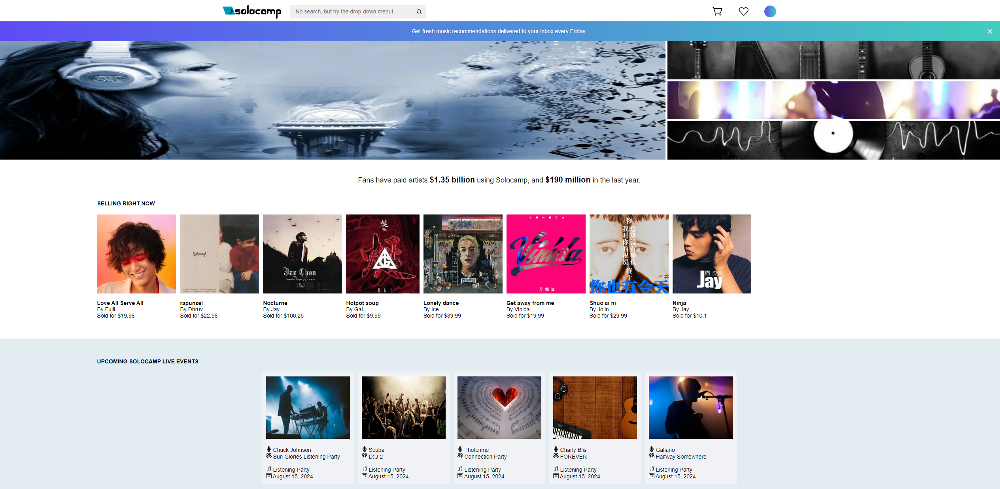
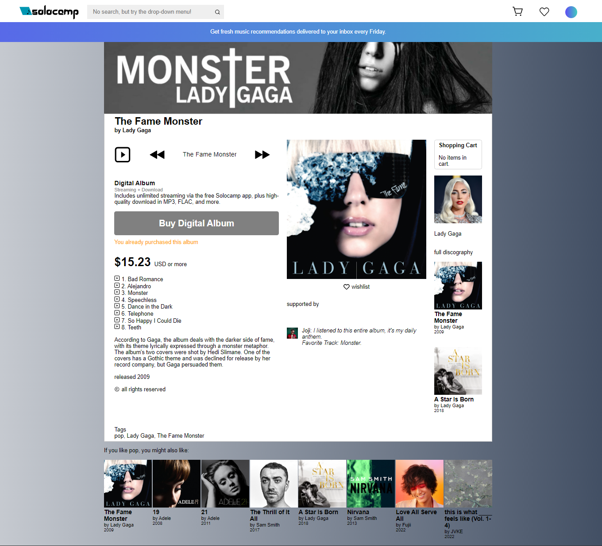
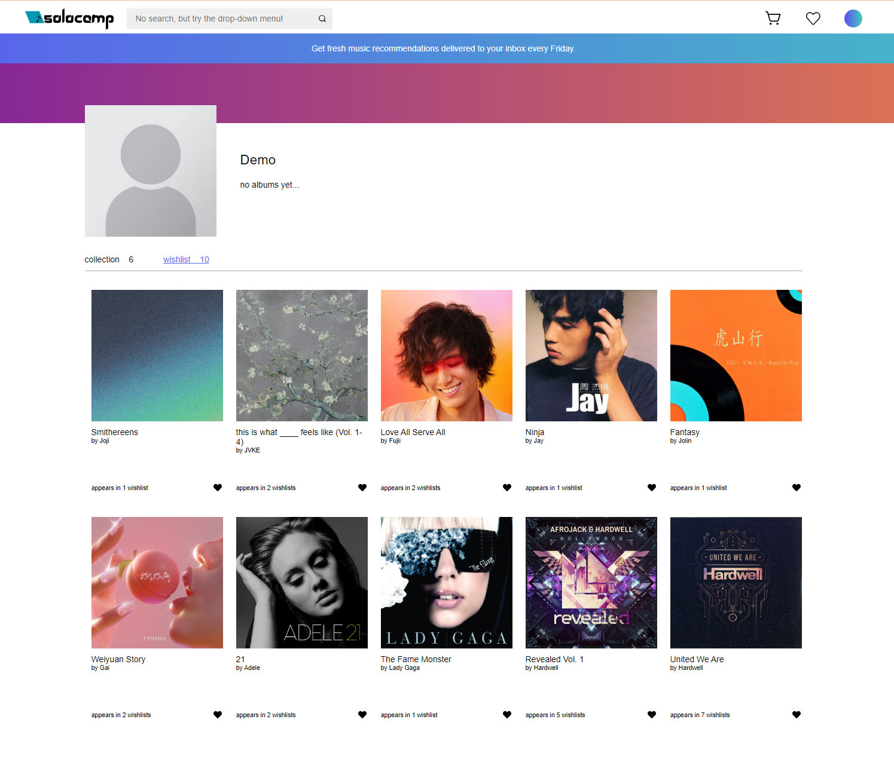

# Solocamp

Welcome to Solocamp, a versatile platform designed for music enthusiasts who appreciate the mainstream, the niche and indie artists. Solocamp offers a seamless experience whether you're a fan of top-charting artists or love discovering, "purchasing", and supporting underground and independent musicians.

### Discover Hidden Gems

Solocamp is the place to explore and find music that resonates with your test. Our platform is tailored to highlight the creative works of artists who may not be in the mainstream spotlight but have immense talent and passion.

### Listen to your Favorite Artists

Solocamp offers a diverse catalog that caters to every musical taste. Our platform makes it easy to explore new sounds, whether you're searching for the latest hits or newly emerging artists.


## Live Site URL

https://solocamp.onrender.com/


## Live Site Preview

### Solocamp Homepage



### Solocamp Album Details



### Solocamp Album/Genre Listings


### Solocamp Wishlist




## Key Features

- **Backend with Flask and SQLAlchemy**: Implemented robust backend routes using Flask and SQLAlchemy. This setup ensures efficient data handling, secure API endpoints, and seamless interactions between the frontend and the database, providing a solid foundation for the platform's functionality.
- **Dynamic UI powered by React, Redux, and React Router**: Developed a responsive and visually compelling use interface utilizing React, Redux, and React Router.Implemented modern UX/UI principles to create a smooth, intuitive user experience with efficient state management and easy navigation throughout the platform.
- **Full CRUD Functionality for Albums and Reviews**: Developed comprehensive CRUD operations for album management and reviews, allowing users to create, read, update, and delete their own albums and reviews within the platform.
- **Genre-Based Filtering**: Includes a dynamic filter feature that allows users to search and browse music by genre, making it easy to discover albums and artists that match their musical preferences.
- **Music Player**: Built a functional music player that allows users to stream tracks on the platform. The player supports features like play, pause, skip to the next song, and go back to the previous song.
- **Wishlist Management**: Seamlessly integrated into the user experience, Users can easily add and manage their favorite albums through a personalized wishlist feature. This functionality allows users to save albums they are interested in, providing a convenient way to keep track of their favorites and revisit them later.
- **"Purchase"** albums with ease by adding it to your shopping cart and going through the checkout process


## Technologies Used


## Getting started

1. Clone this repository (only this branch).

2. Install dependencies.

   ```bash
   pipenv install -r requirements.txt
   ```

3. Create a **.env** file based on the example with proper settings for your
   development environment.

4. Make sure the SQLite3 database connection URL is in the **.env** file.

5. This starter organizes all tables inside the `flask_schema` schema, defined
   by the `SCHEMA` environment variable. Replace the value for
   `SCHEMA` with a unique name, **making sure you use the snake_case
   convention.**

6. Get into your pipenv, migrate your database, seed your database, and run your
   Flask app:

   ```bash
   pipenv shell
   ```

   ```bash
   flask db upgrade
   ```

   ```bash
   flask seed all
   ```

   ```bash
   flask run
   ```

7. The React frontend has no styling applied. Copy the **.css** files from your
   Authenticate Me project into the corresponding locations in the
   **react-vite** folder to give your project a unique look.

8. To run the React frontend in development, `cd` into the **react-vite**
   directory and run `npm i` to install dependencies. Next, run `npm run build`
   to create the `dist` folder. The starter has modified the `npm run build`
   command to include the `--watch` flag. This flag will rebuild the **dist**
   folder whenever you change your code, keeping the production version up to
   date.


# API Documentation - Backend API Routes

## USER AUTHENTICATION/AUTHORIZATION

### All endpoints that require authentication

All endpoints that require a current user to be logged in.

- Request: endpoints that require authentication
- Error Response: Require authentication

  - Status Code: 401
  - Headers:
    - Content-Type: application/json
  - Body:

    ```json
    {
      "message": "Authentication required"
    }
    ```

### All endpoints that require proper authorization

All endpoints that require authentication and the current user does not have the
correct role(s) or permission(s).

- Request: endpoints that require proper authorization
- Error Response: Require proper authorization

  - Status Code: 403
  - Headers:
    - Content-Type: application/json
  - Body:

    ```json
    {
      "message": "Forbidden"
    }
    ```

### Get the Current User

Returns the information about the current user that is logged in.

- Require Authentication: false
- Request

  - Method: GET
  - URL: /api/session
  - Body: none

- Successful Response when there is a logged in user

  - Status Code: 200
  - Headers:
    - Content-Type: application/json
  - Body:

    ```json
    {
      "user": {
        "id": 1,
        "first_name": "John",
        "last_name": "Smith",
        "email": "john.smith@gmail.com",
        "username": "JohnSmith",
        "profile_image": "http://website.com/image.jpg"
      }
    }
    ```

- Successful Response when there is no logged in user

  - Status Code: 200
  - Headers:
    - Content-Type: application/json
  - Body:

    ```json
    {
      "user": null
    }
    ```

### Log In a User

Logs in a current user with valid credentials and returns the current user's
information.

- Require Authentication: false
- Request

  - Method: POST
  - URL: /api/session
  - Headers:
    - Content-Type: application/json
  - Body:

    ```json
    {
      "credential": "john.smith@gmail.com",
      "password": "secret password"
    }
    ```

- Successful Response

  - Status Code: 200
  - Headers:
    - Content-Type: application/json
  - Body:

    ```json
    {
      "user": {
        "id": 1,
        "first_name": "John",
        "last_name": "Smith",
        "email": "john.smith@gmail.com",
        "username": "JohnSmith",
        "profile_image": "http://website.com/image.jpg"
      }
    }
    ```

- Error Response: Invalid credentials

  - Status Code: 401
  - Headers:
    - Content-Type: application/json
  - Body:

    ```json
    {
      "message": "Invalid credentials"
    }
    ```

- Error response: Body validation errors

  - Status Code: 400
  - Headers:
    - Content-Type: application/json
  - Body:

    ```json
    {
      "message": "Bad Request",
      "errors": {
        "credential": "Email or username is required",
        "password": "Password is required"
      }
    }
    ```

### Sign Up a User

Creates a new user, logs them in as the current user, and returns the current
user's information.

- Require Authentication: false
- Request

  - Method: POST
  - URL: /api/users
  - Headers:
    - Content-Type: application/json
  - Body:

    ```json
    {
      "id": 1,
      "first_name": "John",
      "last_name": "Smith",
      "email": "john.smith@gmail.com",
      "username": "JohnSmith",
      "profile_image": "http://website.com/image.jpg"
    }
    ```

- Successful Response

  - Status Code: 200
  - Headers:
    - Content-Type: application/json
  - Body:

    ```json
    {
      "user": {
        "id": 1,
        "first_name": "John",
        "last_name": "Smith",
        "email": "john.smith@gmail.com",
        "username": "JohnSmith",
        "profile_image": "http://website.com/image.jpg"
      }
    }
    ```

- Error response: User already exists with the specified email

  - Status Code: 500
  - Headers:
    - Content-Type: application/json
  - Body:

    ```json
    {
      "message": "Username is already in use.",
      "errors": {
        "email": "Email address is already in use."
      }
    }
    ```

- Error response: User already exists with the specified username

  - Status Code: 500
  - Headers:
    - Content-Type: application/json
  - Body:

    ```json
    {
      "message": "Username is already in use.",
      "errors": {
        "username": "User with that username already exists"
      }
    }
    ```

- Error response: Body validation errors

  - Status Code: 400
  - Headers:
    - Content-Type: application/json
  - Body:

    ```json
    {
      "message": "Bad Request",
      "errors": {
        "email": "Invalid email",
        "username": "Username is required",
        "first_name": "First Name is required",
        "last_name": "Last Name is required",
        "profile_picture": "Must be a valid URL"
      }
    }
    ```


## Album Routes

### Get all Albums

Returns all the Albums

- Require Authentication: false
- Request

  - Method: GET
  - URL: /api/albums/
  - Body: none

- Successful Response

  - Status Code: 200
  - Headers:
    - Content-Type: application/json
  - Body:

    ```json
    [
      {
        "id": 1,
        "name": "New Album",
        "user_id": 1,
        "year": 2017,
        "genre": "pop",
        "price": 19.99,
        "description": "A description of the album",
        // additional attributes from the to_dict()
        "supported_by": null,
        "user_profile_image": "http://website.com/image.jpg",
        "user_username": "Artist",
        "songs": [
          {
            "album_id": 1,
            "id": 1,
            "song_url": "http://website.com/song.mp3",
            "title": "Cool Song Name",
            "track_number": 1,
            "user_id": 2
          }
        ],
        "album_art": [
          {
            "album_art": "http://website.com/image.jpg",
            "album_banner": "http://website.com/image.jpg",
            "album_id": 1,
            "background_color": "rgb(0,0,0)",
            "id": 1
          }
        ]
      }
    ]
    ```

### Get details of a Album from an id

Returns the details of a album specified by its id.

- Request

  - Method: GET
  - URL: /api/albums/:albumId
  - Body: none

- Successful Response

  - Status Code: 200
  - Headers:
    - Content-Type: application/json
  - Body:

    ```json
    {
      "id": 1,
      "name": "Album Name",
      "user_id": 1,
      "year": 2013,
      "genre": "pop",
      "price": 12.55,
      "description": "a description of the album.",

      // addition attributes in to_dict()
      "songs": [
        {
          "album_id": 6,
          "id": 31,
          "song_url": "http://website.com/song.mp3",
          "title": "Song Title",
          "track_number": 1,
          "user_id": 4
        }
      ],
      "supported_by": [
        {
          "album_art": "http://website.com/image.jpg",
          "album_id": 6,
          "album_posted_by_username": "Artist Name",
          "album_title": "Album Title",
          "created_at": "Sun, 18 Aug 2024 21:03:36 GMT",
          "description": "Amazing artist",
          "id": 11,
          "song_id": 33,
          "song_title": "Song Title",
          "user_id": 5,
          "user_profile_image": "http://website.com/image.jpg",
          "user_username": "User that left review"
        }
      ],
      "album_art": [
        {
          "album_art": "http://website.com/image.jpg",
          "album_banner": "http://website.com/image.jpg",
          "album_id": 6,
          "background_color": "rgb(0, 0, 0)",
          "id": 6
        }
      ],
      "user_profile_image": "http://website.com/image.jpg",
      "user_username": "Artist Name"
    }
    ```

- Error response: Couldn't find a Album with the specified id

  - Status Code: 404
  - Headers:
    - Content-Type: application/json
  - Body:

    ```json
    {
      "message": "Album not found"
    }
    ```

### Create an Album

Creates and returns a new Album.

- Require Authentication: true
- Request

  - Method: POST
  - URL: /api/albums
  - Headers:
    - Content-Type: application/json
  - Body:

    ```json
    {
      "id": 1,
      "name": "Album Name",
      "user_id": 4,
      "year": 2013,
      "genre": "pop",
      "price": 12.55,
      "description": "a description of the album."
    }
    ```

- Successful Response

  - Status Code: 201
  - Headers:
    - Content-Type: application/json
  - Body:

    ```json
    {
      "id": 1,
      "name": "Album Name",
      "user_id": 4,
      "year": 2013,
      "genre": "pop",
      "price": 12.55,
      "description": "A description of the album."
    }
    ```

- Error Response: Body validation errors

  - Status Code: 400
  - Headers:
    - Content-Type: application/json
  - Body:

    ```json
    {
      "message": "Bad Request",
      "errors": {
        "name": "Name must be between 2 and 100 characters.",
        "year": "Must be between 1900 and 2100.",
        "genre": "Genre is required",
        "price": "Price must be between 0.01 and 9999.99.",
        "description": "Description must be between 10 and 9000 characters."
      }
    }
    ```

### Edit an Album

Updates and returns an existing album.

- Require Authentication: true
- Require proper authorization: Album must belong to the current user
- Request

  - Method: PUT
  - URL: /api/albums/:albumId
  - Headers:
    - Content-Type: application/json
  - Body:

    ```json
    {
      "name": "Updated Album Name",
      "user_id": 1,
      "year": 2020,
      "genre": "r&b",
      "price": 19.99,
      "description": "Updated description of the album."
    }
    ```

- Successful Response

  - Status Code: 200
  - Headers:
    - Content-Type: application/json
  - Body:

    ```json
    {
      "id": 1,
      "name": "Updated Album Name",
      "user_id": 1,
      "year": 2020,
      "genre": "r&b",
      "price": 19.99,
      "description": "Updated description of the album."
    }
    ```

- Error Response: Body validation errors

  - Status Code: 400
  - Headers:
    - Content-Type: application/json
  - Body:

    ```json
    {
      "message": "Bad Request",
      "errors": {
        "name": "Name must be between 2 and 100 characters.",
        "year": "Must be between 1900 and 2100.",
        "genre": "Genre is required",
        "price": "Price must be between 0.01 and 9999.99.",
        "description": "Description must be between 10 and 9000 characters."
      }
    }
    ```

- Error response: Couldn't find an Album with the specified id

  - Status Code: 404
  - Headers:
    - Content-Type: application/json
  - Body:

    ```json
    {
      "message": "Album not found"
    }
    ```

### Delete an Album

Deletes an existing Album.

- Require Authentication: true
- Require proper authorization: Album must belong to the current user
- Request

  - Method: DELETE
  - URL: /api/albums/:albumId
  - Body: none

- Successful Response

  - Status Code: 200
  - Headers:
    - Content-Type: application/json
  - Body:

    ```json
    {
      "message": "Album successfully deleted"
    }
    ```

- Error response: Couldn't find an Album with the specified id

  - Status Code: 404
  - Headers:
    - Content-Type: application/json
  - Body:

    ```json
    {
      "message": "Album not found"
    }
    ```


## REVIEWS (SUPPORTED-BYS)

### Get all Reviews of the Current User

Returns all the reviews written by the current user.

- Require Authentication: true
- Request

  - Method: GET
  - URL: /api/supported-by/all
  - Body: none

- Successful Response

  - Status Code: 200
  - Headers:
    - Content-Type: application/json
  - Body:

    ```json
    {
      "Reviews": [
        {
          "id": 1,
          "description": "Album review",
          "album_id": 1,
          "song_id": 57,
          "user_id": 2,

          // attributes added to to_dict()
          "album_title": "Album Title",
          "album_art": "https://website.com/image.jpg",
          "album_posted_by_username": "Artist Name",
          "song_title": "Song Title",
          "user_profile_image": "https://website.com/image.jpg",
          "user_username": "Album user Id",
          "created_at": "Sun, 18 Aug 2024 21:03:36 GMT"
        },
        {
          "id": 2,
          "description": "Album review",
          "album_id": 1,
          "song_id": 34,
          "user_id": 3,

          // attributes added to to_dict()
          "album_title": "Album Title",
          "album_art": "https://website.com/image.jpg",
          "album_posted_by_username": "Artist Name",
          "song_title": "Song Title",
          "user_profile_image": "https://website.com/image.jpg",
          "user_username": "Album user Id",
          "created_at": "Sun, 18 Aug 2024 21:03:36 GMT"
        }
      ]
    }
    ```

### Get all Reviews by an Album's id

Returns all the reviews that belong to an Album specified by id.

- Require Authentication: false
- Request

  - Method: GET
  - URL: /api/albums/:albumId/supported-bys
  - Body: none

- Successful Response

  - Status Code: 200
  - Headers:
    - Content-Type: application/json
  - Body:

  ```json
  {
    "Reviews": [
      {
        "id": 1,
        "description": "Album review",
        "album_id": 1,
        "song_id": 57,
        "user_id": 2,

        // attributes added to to_dict()
        "album_title": "Album Title",
        "album_art": "https://website.com/image.jpg",
        "album_posted_by_username": "Artist Name",
        "song_title": "Song Title",
        "user_profile_image": "https://website.com/image.jpg",
        "user_username": "Album user Id",
        "created_at": "Sun, 18 Aug 2024 21:03:36 GMT"
      }
    ]
  }
  ```

- Error response: Couldn't find an Album with the specified id

  - Status Code: 404
  - Headers:
    - Content-Type: application/json
  - Body:

    ```json
    {
      "message": "Album not found"
    }
    ```

### Create a Review for an Album based on the Album's id

Create and return a new review for an Album specified by id.

- Require Authentication: true
- Request

  - Method: POST
  - URL: /api/supported-by/album/:albumId
  - Headers:
    - Content-Type: application/json
  - Body:

    ```json
    {
      "description": "New review for the album.",
      "song_id": 1
    }
    ```

- Successful Response

  - Status Code: 201
  - Headers:
    - Content-Type: application/json
  - Body:

    ```json
    {
      "description": "New review for the album.",
      "song_id": 1
    }
    ```

- Error Response: Body validation errors

  - Status Code: 400
  - Headers:
    - Content-Type: application/json
  - Body:

    ```json
    {
      "message": "Bad Request",
      "errors": {
        "description": "Description must be at least 3 characters long."
      }
    }
    ```

- Error response: Couldn't find an Album with the specified id

  - Status Code: 404
  - Headers:
    - Content-Type: application/json
  - Body:

    ```json
    {
      "message": "Album not found"
    }
    ```

- Error response: Review from the current user already exists for the Album

  - Status Code: 500
  - Headers:
    - Content-Type: application/json
  - Body:

    ```json
    {
      "message": "User cannot leave more than one review on an album!"
    }
    ```

### Edit a Review

Update and return an existing review.

- Require Authentication: true
- Require proper authorization: Review must belong to the current user
- Request

  - Method: PUT
  - URL: /api/supported-by/:supportedById
  - Headers:
    - Content-Type: application/json
  - Body:

    ```json
    {
      "description": "Updated existing review for the album.",
      "song_id": 3
    }
    ```

- Successful Response

  - Status Code: 200
  - Headers:
    - Content-Type: application/json
  - Body:

    ```json
    {
      "description": "Updated existing review for the album.",
      "song_id": 3,
      "createdAt": "2021-11-19 20:39:36",
      "updatedAt": "2021-11-20 10:06:40"
    }
    ```

- Error Response: Body validation errors

  - Status Code: 400
  - Headers:
    - Content-Type: application/json
  - Body:

    ```json
    {
      "message": "Bad Request",
      "errors": {
        "description": "Description must be at least 3 characters long."
      }
    }
    ```

- Error response: Couldn't find a Review with the specified id

  - Status Code: 404
  - Headers:
    - Content-Type: application/json
  - Body:

    ```json
    {
      "message": "Review not found"
    }
    ```

### Delete a Review

Delete an existing review.

- Require Authentication: true
- Require proper authorization: Review must belong to the current user
- Request

  - Method: DELETE
  - URL: /api/supported-by/:supportedById
  - Body: none

- Successful Response

  - Status Code: 200
  - Headers:
    - Content-Type: application/json
  - Body:

    ```json
    {
      "message": "Review deleted successfully"
    }
    ```

- Error response: Couldn't find a Review with the specified id

  - Status Code: 404
  - Headers:
    - Content-Type: application/json
  - Body:

    ```json
    {
      "message": "Review couldn't be found"
    }
    ```


## Shopping Cart Routes

### Get all of the Current User's Shopping Cart

Return all the albums in the Current User's Shopping Cart

- Require Authentication: true
- Request

  - Method: GET
  - URL: /api/shopping-cart/all
  - Body: none

- Successful Response

  - Status Code: 200
  - Headers:
    - Content-Type: application/json
  - Body:

    ```json
    {
      "ShoppingCart": [
        {
          "id": 1,
          "name": "Album Name",
          "user_id": 1,
          "year": 2013,
          "genre": "pop",
          "price": 12.55,
          "description": "a description of the album.",

          // addition attributes in to_dict()
          "songs": [
            {
              "album_id": 6,
              "id": 31,
              "song_url": "http://website.com/image.jpg",
              "title": "Song Title",
              "track_number": 1,
              "user_id": 4
            }
          ],
          "supported_by": [
            {
              "album_art": "http://website.com/image.jpg",
              "album_id": 6,
              "album_posted_by_username": "Artist Name",
              "album_title": "Album Title",
              "created_at": "Sun, 18 Aug 2024 21:03:36 GMT",
              "description": "Amazing artist",
              "id": 11,
              "song_id": 33,
              "song_title": "Song Title",
              "user_id": 5,
              "user_profile_image": "http://website.com/image.jpg",
              "user_username": "User that left review"
            }
          ],
          "album_art": [
            {
              "album_art": "http://website.com/image.jpg",
              "album_banner": "http://website.com/image.jpg",
              "album_id": 6,
              "background_color": "rgb(0, 0, 0)",
              "id": 6
            }
          ],
          "user_profile_image": "http://website.com/image.jpg",
          "user_username": "Artist Name"
        }
      ]
    }
    ```

### Create the shopping cart of the Current User by User Id

Create and return the shopping cart of the Current User by User Id.

- Require Authentication: true
- Require proper authorization: User must be logged in

  - Method: POST
  - URL: /api/albums/:albumId/shopping-cart
  - Headers:
    - Content-Type: application/json
  - Body: False

- Successful Response

  - Status Code: 200
  - Headers:
    - Content-Type: application/json
  - Body:

    ```json
    {
      "message": "Album added to shopping cart"
    }
    ```

- Error response: Couldn't find an Album with the specified id

  - Status Code: 404
  - Headers:
    - Content-Type: application/json
  - Body:

    ```json
    {
      "message": "Album not found"
    }
    ```

- Error response: Cannot add their own albums to their Shopping Cart

  - Status Code: 403
  - Headers:
    - Content-Type: application/json
  - Body:

    ```json
    {
      "message": "Forbidden, user cannot add their own album to their shopping cart"
    }
    ```

### Delete an Album from the Shopping Cart

Delete Album(s) from the Shopping Cart

- Require Authentication: true
- Require proper authorization: Shopping cart must belong to the current user or there must be albums in the shopping cart
- Request

  - Method: DELETE
  - URL: /api/shopping-cart/:albumId
  - Body: none

- Successful Response

  - Status Code: 200
  - Headers:
    - Content-Type: application/json
  - Body:

    ```json
    {
      "message": "Album has been successfully removed from your shopping cart"
    }
    ```

- Error response: Couldn't find an Album with the specified id

  - Status Code: 404
  - Headers:
    - Content-Type: application/json
  - Body:

    ```json
    {
      "message": "Album not found"
    }
    ```

- Error response: Couldn't find an Album with the specified id in the Shopping Cart

  - Status Code: 404
  - Headers:
    - Content-Type: application/json
  - Body:

    ```json
    {
      "message": "Album not in shopping cart"
    }
    ```


## Wishlist Routes

### Get all of the Current User's Wishlist

Return all the albums in the Current User's Wishlist

- Require Authentication: true
- Request

  - Method: GET
  - URL: /api/wishlist/all
  - Body: none

- Successful Response

  - Status Code: 200
  - Headers:
    - Content-Type: application/json
  - Body:

    ```json
    {
      "Wishlist": [
        {
          "count": 2,
          "id": 1,
          "name": "Album Name",
          "user_id": 12
        },
        {
          "count": 1,
          "id": 2,
          "name": "Album Name2",
          "user_id": 12
        },
        {
          "count": 1,
          "id": 3,
          "name": "Album Name3",
          "user_id": 12
        }
      ]
    }
    ```

### Create the wishlist of the Current User by User Id

Create and return the wishlist of the Current User by User Id.

- Require Authentication: true
- Require proper authorization: User must be logged in

  - Method: POST
  - URL: /api/albums/:albumId/wishlist
  - Headers:
    - Content-Type: application/json
  - Body: none

- Successful Response

  - Status Code: 200
  - Headers:
    - Content-Type: application/json
  - Body:

    ```json
    {
      "message": "Album added to wishlist"
    }
    ```

- Error response: Couldn't find an Album with the specified id

  - Status Code: 404
  - Headers:
    - Content-Type: application/json
  - Body:

    ```json
    {
      "message": "Album not found"
    }
    ```

- Error response: Cannot add their own albums to their wishlist

  - Status Code: 403
  - Headers:
    - Content-Type: application/json
  - Body:

    ```json
    {
      "message": "Forbidden, user cannot add their own album to their wishlist"
    }
    ```

### Delete an Album from the Wishlist

Delete Album(s) from the Wishlist

- Require Authentication: true
- Require proper authorization: Wishlist must belong to the current user or there must be albums in the Wishlist
- Request

  - Method: DELETE
  - URL: /api/shopping-cart/:albumId
  - Body: none

- Successful Response

  - Status Code: 200
  - Headers:
    - Content-Type: application/json
  - Body:

    ```json
    {
      "message": "Album has been successfully removed from your Wish list"
    }
    ```

- Error response: Couldn't find an Album with the specified id

  - Status Code: 404
  - Headers:
    - Content-Type: application/json
  - Body:

    ```json
    {
      "message": "Album not found"
    }
    ```

- Error response: Couldn't find an Album with the specified id in the Wishlist

  - Status Code: 404
  - Headers:
    - Content-Type: application/json
  - Body:

    ```json
    {
      "message": "Album not in wishlist"
    }
    ```


## Deployment through Render.com

First, recall that Vite is a development dependency, so it will not be used in
production. This means that you must already have the **dist** folder located in
the root of your **react-vite** folder when you push to GitHub. This **dist**
folder contains your React code and all necessary dependencies minified and
bundled into a smaller footprint, ready to be served from your Python API.

Begin deployment by running `npm run build` in your **react-vite** folder and
pushing any changes to GitHub.

Refer to your Render.com deployment articles for more detailed instructions
about getting started with [Render.com], creating a production database, and
deployment debugging tips.

From the Render [Dashboard], click on the "New +" button in the navigation bar,
and click on "Web Service" to create the application that will be deployed.

Select that you want to "Build and deploy from a Git repository" and click
"Next". On the next page, find the name of the application repo you want to
deploy and click the "Connect" button to the right of the name.

Now you need to fill out the form to configure your app. Most of the setup will
be handled by the **Dockerfile**, but you do need to fill in a few fields.

Start by giving your application a name.

Make sure the Region is set to the location closest to you, the Branch is set to
"main", and Runtime is set to "Docker". You can leave the Root Directory field
blank. (By default, Render will run commands from the root directory.)

Select "Free" as your Instance Type.

### Add environment variables

In the development environment, you have been securing your environment
variables in a **.env** file, which has been removed from source control (i.e.,
the file is gitignored). In this step, you will need to input the keys and
values for the environment variables you need for production into the Render
GUI.

Add the following keys and values in the Render GUI form:

- SECRET_KEY (click "Generate" to generate a secure secret for production)
- FLASK_ENV production
- FLASK_APP app
- SCHEMA (your unique schema name, in snake_case)

In a new tab, navigate to your dashboard and click on your Postgres database
instance.

Add the following keys and values:

- DATABASE_URL (copy value from the **External Database URL** field)

**Note:** Add any other keys and values that may be present in your local
**.env** file. As you work to further develop your project, you may need to add
more environment variables to your local **.env** file. Make sure you add these
environment variables to the Render GUI as well for the next deployment.

### Deploy

Now you are finally ready to deploy! Click "Create Web Service" to deploy your
project. The deployment process will likely take about 10-15 minutes if
everything works as expected. You can monitor the logs to see your Dockerfile
commands being executed and any errors that occur.

When deployment is complete, open your deployed site and check to see that you
have successfully deployed your Flask application to Render! You can find the
URL for your site just below the name of the Web Service at the top of the page.

**Note:** By default, Render will set Auto-Deploy for your project to true. This
setting will cause Render to re-deploy your application every time you push to
main, always keeping it up to date.

[Render.com]: https://render.com/
[Dashboard]: https://dashboard.render.com/
